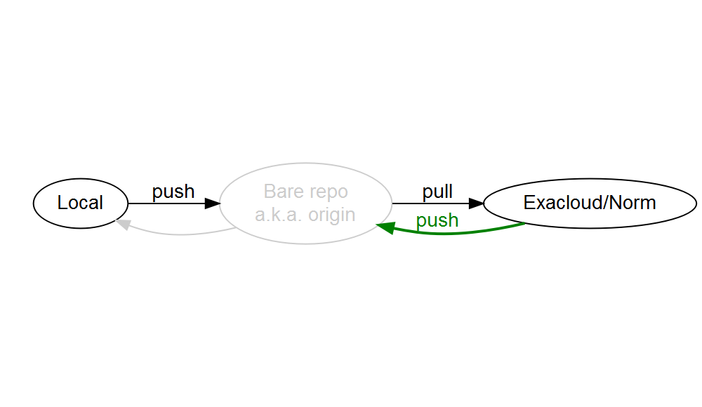

---

# Analytic Workflow with Git on Exacloud/Norm


Presentation for OHSU-PSU SPH BDP staff meeting, November 22, 2016.


# Wishlist

These are the features I'm looking for in a project management workflow:

* **Track** project history
* **Undo** infinitely
* **Branch** what-if scenarios (without breaking primary analysis)
* **Sync** local workstation with other computers
* **Share** with collaborators
  * Most important collaborators: past-self and future-self
* **Package** project for a code repository

---

# Sync

Typical workflow using a local workstation and a compute cluster

1. Start on local workstation
  1. Initialize and setup a project
  1. Rapidly develop on simulated data or a small subset of data
  1. Test code (as opposed to test analysis)
  1. Test-revise until ready to...
1. Scale up on Exacloud/Norm
  1. Run analysis on full data
  1. Revise analysis
  1. Generate and collect analytic products for...
1. Synthesis on local workstation
  1. Refine analysis into a final product
  1. Handoff to stakeholder
  1. Package entire project into a repository for archive


I could simply copy-paste or SFTP files without the **Sync** feature.
If the data is small and I don't need to scale up, then I can skip the **Sync** feature.
But I still want the other [features](README.md#wishlist).


## Install git

1. Install [Git](https://git-scm.com/) on local workstation
   * Includes a GUI tool
1. *Optional* Install a 3rd-party [GUI client](https://git-scm.com/downloads/guis)
1. Exacloud/Norm already has git installed


## Initialize a local project repo


From your local Git Bash command line:

1. Navigate into the working directory
1. Initialize a git repository

```
$ cd <working-directory>
$ git init
```


## Bare repositories

To make the connection to **Sync** to/from, we need to create something called a **bare repository**.

Bare repositories can exist anywhere.
E.g., on a local drive, on the Exacloud/Norm Linux filesystem, [GitHub](https://github.com).
The only constraint is connectivity; all computers you use need to be able to *see* the bare repo.

Bare repo location | Pros | Cons
:---|:---|:---
Local | Private | Exacloud/Norm won't connect to it
[Box.com](https://ohsu.account.box.com) | Shareable | Exacloud/Norm won't connect to it
Home directory on Exacloud/Norm `~` | Private, behind OHSU firewall | Behind OHSU firewall
Group directory on Exacloud/Norm `/home/groups/biostats` | Shareable, behind OHSU firewall | Behind OHSU firewall
[GitHub](https://github.com) | Shareable to anyone | In the cloud

Techincally speaking, a bare repository is a repo that doesn't contain any working files.
Practically speaking, once a bare repo is set up, it's invisible to the user.


## Initialize a bare repo 

From the Linux command line on Exacloud/Norm:

1. Create a directory with the `.git` extension
1. Navigate into the directory
1. Initialize a bare repository

```
$ mkdir <repo-name>.git
$ cd <repo-name>.git
$ git init --bare
```


## Connect local repo to bare

From your local Git Bash command line:

```
$ git remote add origin <username>@exacloud.ohsu.edu:<repo-name>.git
```


The bare repo is greyed-out because, as I said, it's mostly invisible to the user.


## Push your local repo

From your local Git Bash command line:

```
$ git push origin master
```


Now, the bare repo is an exact copy of your local working directory.
From this, you will clone to Exacloud/Norm


## Clone on Exacloud/Norm filesystem

From the Linux command line on Exacloud/Norm:

1. Navigate into the working directory
1. Clone for the bare repo

```
$ cd <working-directory>
$ git clone <repo-name>.git
```


Cloning does 3 things:

1. Initializes the working repo
1. Establishes the connection to the bare repo
1. Pulls the contents of the bare repo into the working repo


## Create, stage, commit in Exacloud/Norm repo

Create a `Hello world` file.
Stage `test.txt` using `git add`.
Commit changes with a meaningful message using `git commit`.
Add another line to `test.txt`.
Stage and commit changes.
Check `git status` liberally.

```
$ git status
$ echo "Hello world. This is a test file." > test.txt
$ git status
$ git add test.txt
$ git status
$ git commit -m "Create hello world file"
$ git status
$ echo "Created by me." >> test.txt
$ git status
$ git add test.txt
$ git status
$ git commit -m "Add attribution"
$ git status
```


## Push your Exacloud/Norm repo

From the Linux command line on Exacloud/Norm:

```
$ git push origin master
```




## Pull to your local repo

From your local Git Bash command line:

```
$ git pull origin master
```


## Complete workflow


## Clone this repo!

From your local Git Bash command line:

```
$ cd <parent-directory-where-you-want-the-working-directory-to-reside>
$ git clone <username>@exacloud.ohsu.edu:/home/groups/biostats/chanb/Repos/Workflow.git
$ cd Workflow
$ git status
```
