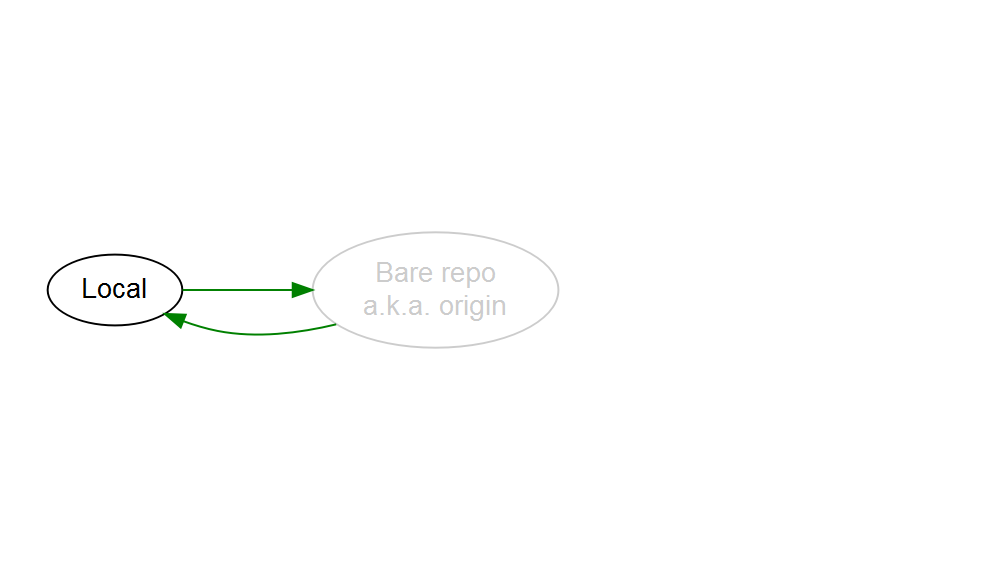
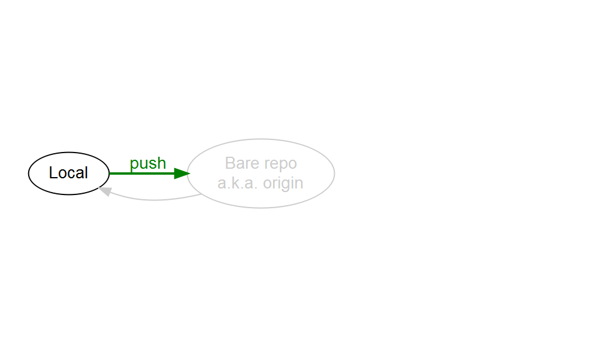
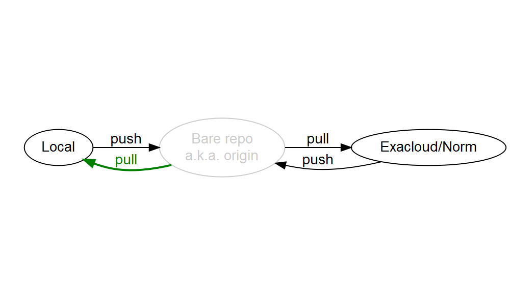

---

# Analytic Workflow with Git on Exacloud/Norm


Presentation for OHSU-PSU SPH BDP staff meeting, November 22, 2016.


---

# Why?

Feature checklist

* **Track** project history
* **Undo** infinitely
* **Branch** what-if scenarios (without breaking primary analysis)
* **Sync** local workstation with other computers
* **Share** with collaborators
  * Most important collaborators: past-self and future-self
* **Package** project for a code repository


# Typical workflow

1. Start on local workstation
  1. Initialize and setup a project
  1. Rapidly develop on simulated data or a small subset of data
  1. Test code (as opposed to test analysis)
  1. Test-revise until ready to...
1. Scale up on Exacloud/Norm
  1. Run analysis on full data
  1. Revise analysis
  1. Generate and collect analytic products for...
1. Synthesis on local workstation
  1. Refine analysis into a final product
  1. Handoff to stakeholder
  1. Package entire project into a repository for archive


I could simply copy-paste or FTP files to make this work.
However, that only checks the **Sync** feature, and inelegantly at that.

If the data is small and I don't need to scale up, then I can skip the **Sync** feature.
But I still need to check the other features.


# Install git

1. Install [Git](https://git-scm.com/) on local workstation
   * Includes a GUI tool
1. *Optional* Install a 3rd-party [GUI client](https://git-scm.com/downloads/guis)
1. Exacloud/Norm already has git installed


# Initialize a local project repo


From your local Git Bash command line:

```
$ git init
```


# Bare repositories

To make the connection to **Sync** to/from, we need to create something called a **bare repository**.

Bare repositories can exist anywhere.
E.g., on a local drive, on the Exacloud/Norm Linux filesystem, [GitHub](https://github.com).
The only constraint is that your local workstation and your remote computer need to be able to connect to it.

Bare repo location | Pros | Cons
:---|:---|:---
Local | Private | Exacloud/Norm won't be able to connect to it
Box.com | Shareable | Exacloud/Norm won't be able to connect to it
Home directory on Exacloud/Norm | Private, behind OHSU firewall |
Group directory on Exacloud/Norm | Shareable, behind OHSU firewall |
GitHub | Shareable to anyone | In the cloud

Techincally speaking, a bare repository is a repo that doesn't contain any working files.
Practically speaking, once a bare repo is set up, it's invisible to the user.


# Initialize a bare repo 

From the Linux command line on Exacloud/Norm:

1. Create a directory with the `.git` extension

   ```
   $ mkdir <repo-name>.git
   ```

1. Navigate into the directory

   ```
   $ cd <repo-name>.git
   ```

1. Initialize a bare repository

   ```
   $ git init --bare
   ```


# Connect local repo to bare

From your local Git Bash command line:

```
$ git remote add origin <username>@exacloud.ohsu.edu:<repo-name>.git
```




# Push your local repo

From your local Git Bash command line:

```
$ git push origin master
```




# Initialize a project repo on Exacloud/Norm filesystem

From the Linux command line on Exacloud/Norm:

```
$ git init
```


# Connect Exacloud/Norm repo to bare

From the Linux command line on Exacloud/Norm:

```
$ git remote add origin <repo-name>.git
```


# Pull to your Exacloud/Norm repo

From the Linux command line on Exacloud/Norm:

```
$ git pull origin master
```




# Create, stage, commit in Exacloud/Norm repo

Create a `Hello world` file.
Stage `test.txt` using `git add`.
Commit changes with a meaningly message using `git commit`.
Add another line to `test.txt`.
Stage and commit changes.
Check `git status` liberally.

```
$ git status
$ echo "Hello world. This is a test file." > test.txt
$ git status
$ git add test.txt
$ git status
$ git commit -m "Create hello world file"
$ git status
$ echo "Created by me." >> test.txt
$ git status
$ git add test.txt
$ git status
$ git commit -m "Add attribution"
$ git status
```


# Push your Exacloud/Norm repo

From the Linux command line on Exacloud/Norm:

```
$ git push origin master
```


# Pull to your local repo

From your local Git Bash command line:

```
$ git pull origin master
```


# Complete workflow


