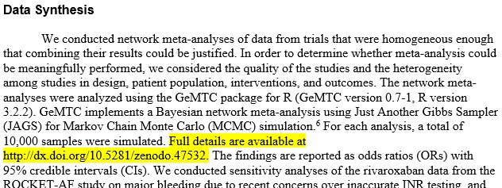

# Git + Github in an analytic workflow


Presentation for OHSU-PSU SPH BDP staff meeting, November 22, 2016.


## Why?

**Problems to solve**

I need a workflow that

1. Tracks project history
1. Allows infinite undos
1. Branches what-if scenarios without breaking primary analysis
1. Syncs my local desktop with the Linux filesystem on Exacloud/Norm
1. Allows sharing with collaborators
1. Packages my project for a code repository


**Solutions**

* [Git](https://git-scm.com/) solves problems #1-3
* [GitHub](https://github.com/) solves problems #4-5


## How?

* Demo git using existing projects

> 

```{r, echo = FALSE}
G <- create_graph(graph_attrs = c("rankdir = LR"),
                  node_attrs = c("fontname = \"Helvetica\""))
G <- G %>% add_node(label = "Local")
render_graph(G)
```

```{r, echo = FALSE}
G <- G %>% add_node(label = "Exacloud/Norm")
render_graph(G)
```

```{r, echo = FALSE}
G <- G %>% add_node(label = "GitHub")
G <- G %>% add_edge(1, 3)
G <- G %>% add_edge(3, 1)
G <- G %>% add_edge(2, 3)
G <- G %>% add_edge(3, 2)
render_graph(G)
```
